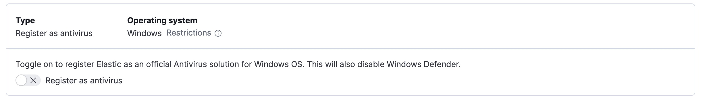
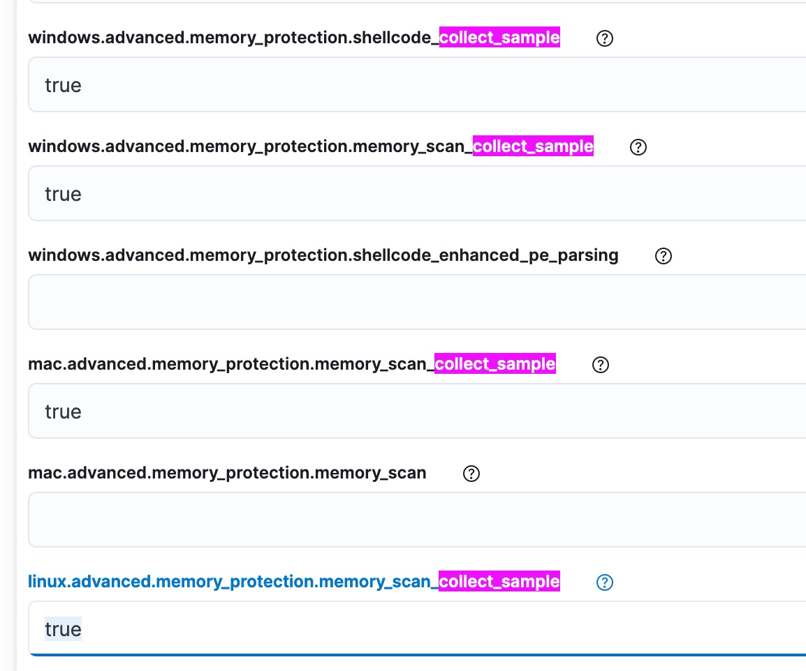

# Title

Speakers:
    - Derek Ditch (GitHub: @dcode)
    - Jessica David (GitHub: @jeska)

## Setup the Environment

Create an Elastic Cloud deployment (or you can set something up locally, checkout
[peasead/elastic-container](https://github.com/peasead/elastic-container) for something you
can spin up using docker-compose).

At a minimum, you'll need Elasticsearch, Kibana, and the Integrations Server. Be sure to save your authentication
credentials for the `elastic` user. You can place them in the `.env` file in the vagrant directory to have all your
values in one place

To use the provided scripts and virtual machine environment, you'll also need a system with enough resources,
a working vagrant environment (`vmware_desktop`, `virtualbox`, and `hyperv` should all work. `vmware_desktop` was tested),
and a working Docker installation to run the script.

## Create an Endpoint Security policy

1. Login to Kibana on your deployment
2. On the left hamburger menu, go to Management -> Integrations -> Endpoint and Cloud Security
3. Click "Add Endpoint and Cloud Security" button
4. Give the integration a name (`endpoint` sounds creative enough)
5. Optionally change the agent policy name. `Agent policy 1` will do.
6. Save and Continue

You'll receive a notification indicating that "Endpoint and Cloud Security integration added."
Click "Add Elastic Agent to your hosts" to continue setup.

If you're using the Vagrant setup in this repo, you just need to copy the enrollment url and token from
the provided command line, similar to the example shown below (wrapped for readability).

Example:

```powershell
.\elastic-agent.exe install
--url=https://ad77e2db35884217b118ef4a0cecac2e.fleet.us-central1.gcp.cloud.es.io:443
--enrollment-token=b1ZfQk80SUJJeVlFalFIODFBX3U6TFAtLTZPbUpRbHU5OWpldXhjVzh1Zw==
```

Paste those values into the `.env` file in the `vagrant` directory. You can either install the
`vagrant-env` plugin to automatically read those into vagrant, or you can export them into your
local environment.

Once the setting are in place, you can just do a `vagrant up` and after some time of provisioning,
you'll have an agent registered with your cloud instance.

## Enhance your Policy

From here, we'd like to add some advanced features to the policy. In Kibana, click the hamburger menu on the left,
go to Security -> Manage. Now, on the left under "Manage", click "Policies" and open our "endpoint" policy. For the
purposes of our demonstration, lets register Elastic as the antivirus solution. Scroll to the bottom of the policy
and you'll see where it is off by default. Toggle that on.



Next, we want to enable the agent to capture up to 4MB memory of detected malware. To do that, click "Show Advanced Settings"
at the bottom of the policy. If you do a search for 'collect_sample", you will see four options: two for Windows, one each for
Mac and Linux. Set those to "true".



Finally, click "Save" in the bottom right. Kibana will alert you that this will affect existing ennnndpoints. Go ahead and confirm.


