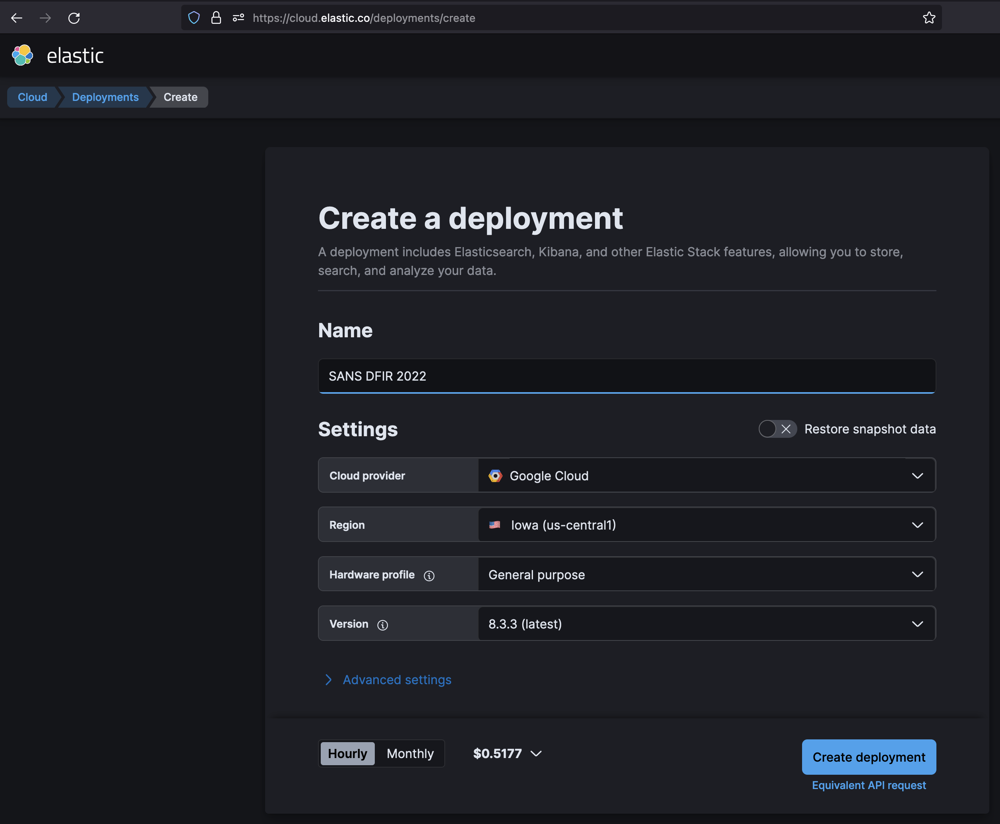

# Elastic Cloud Setup Instructions

These instructions are for users who already have an Elastic Cloud account or wish to experiment with Elastic Cloud.

## Creating a deployment from the UI

After you log in, create a deployment by clicking on the [Create Deployment](https://cloud.elastic.co/deployments/create) link. The UI will lead you through the options for setting up your deployment. A basic example is shown below:



You can change the configuration to use your preferred cloud provider, region, hardware profile, and stack version.

In the advanced settings you can change the storage and availability zones, enabled features, and more. These can be changed after creating the deployment, as well. For more details, see the [Elastic Cloud documentation](https://www.elastic.co/guide/en/cloud/current/ec-create-deployment.html).

## Creating a deployment from the console

If you are an experienced Elastic Cloud user or want to automate your deployment in any way, you may want to use the Elastic Cloud API from the console using CRUD operations. This can also allow you to store your cluster configuration in JSON files in source control. For more information on CRUD operations for cloud deployments, check out the [documentation](https://www.elastic.co/guide/en/cloud/current/ec-api-deployment-crud.html).

Additionally, you can find more details on cloud providers, regions, available templates, and availabe instances in the [Elastic docs](https://www.elastic.co/guide/en/cloud/current/ec-regions-templates-instances.html).

### Creating your API key

API keys should be created through the UI. Instructions can be found in the [docs](https://www.elastic.co/guide/en/cloud/current/ec-api-authentication.html).

Once you have an API key, you can create your deployment in one of two ways.

### Creating a simple deployment

If you do not feel the need to set detailed information about the kinds of instances you want, you can create a deployment using a template ID and default values, as described in the docs [here](https://www.elastic.co/guide/en/cloud/current/ec-api-deployment-crud.html#ec-api-examples-deployment-simple). You can use the [sample file](sample-deployment-simple.json) to create a deployment which would look something like this:

```bash
❯ DEPLOYMENT_TEMPLATE=gcp-general-purpose
❯ EC_API_KEY=abcd0123  # replace with your API key
❯ curl -XPOST \
  -H 'Content-Type: application/json' \
  -H "Authorization: ApiKey $EC_API_KEY" \
  "https://api.elastic-cloud.com/api/v1/deployments?template_id=${DEPLOYMENT_TEMPLATE}" \
  -d @sample-deployment-simple.json
```

The JSON returned will have details such as the cluster ID, name, and Elastic search credentials.

### Creating a detailed deployment

If you would like, you can create a deployment without using a template and instead using detailed information on your node types, regions, versions, etc. It is recommended that you create your deployment from the UI and copy the JSON from the `Equivalent API Request` link (seen in the above screenshot below the `Create Deployment` button) but a [sample](sample-deployment-detailed.json) has also been provided if you want to see an example. The cluster can be deployed in a similar manner:

```bash
❯ EC_API_KEY=abcd0123  # replace with your API key
❯ curl -XPOST \
  -H 'Content-Type: application/json' \
  -H "Authorization: ApiKey $EC_API_KEY" \
  "https://api.elastic-cloud.com/api/v1/deployments" \
  -d @sample-deployment-detailed.json
```